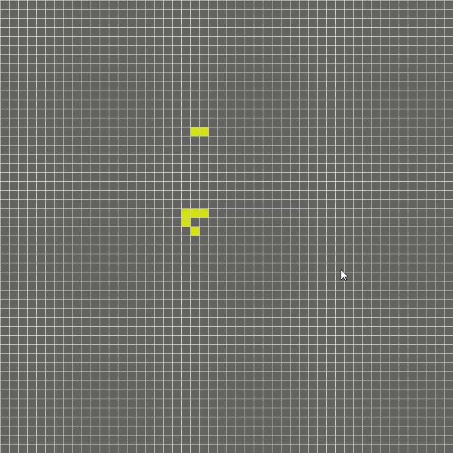
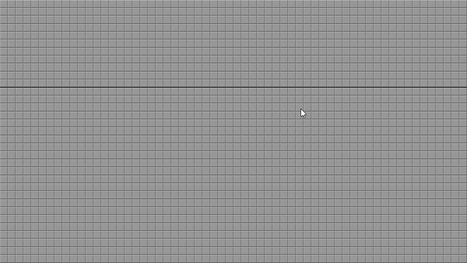

# games

## About

Games made within the Processing.py library. Includes both actively player driven games and automata.

## Sketches

- **GameOfLIfe** - Conway's Game of Life.

- **Minesweeper** - Simple single-player puzzle. Somewhat incomplete in that it starts immediately with no start button or win conditions.

