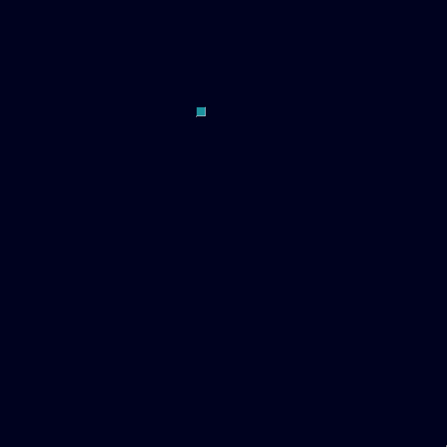
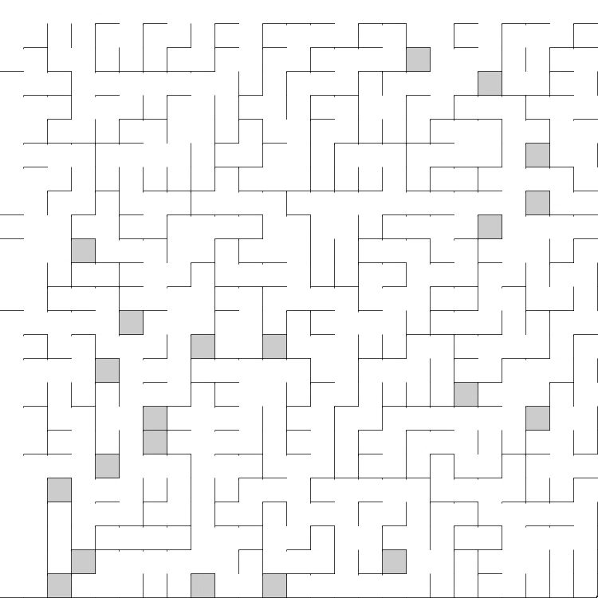

# mazes

## About

Projects that generate mazes using various algorithms. Developed primarily in 2018-2019. All of these are generating simple square mazes, just using different algorithms and occasionally a little twist. Original sketch names have been preserved.

## Sketches

- **MazeGenV2** Second maze generation attempt. First *working* maze implementation. Recursive Backtracker algorithm.

- **MazeGenSolve** - Maze gen with a completed path shown after. Recursive Backtracker algorithm for Generation, A* algorithm for pathfinding (very similar in theory). Exceptionally similar to the Growing Tree algorithm in implementation (1-2 line change).

- **MazeGenBinaryTree** - Binary Tree algorithm. Creates a grid equal to the minimum of the mouse coordinates (increasing from the top-left). Requires some editing to make sure it doesn't automatically crash if you click near the center to bottom-right.

- **MazeGenGrowingTree** - Growing Tree algorithm. Grows centered on where your mouse clicks (originally from a randomized position).

- **MazeGenKruskal** - Kruskal Tree algorithm

- **MazeGenSidewinder** - Sidewinder algorithm. A little bit buggy at the end, but properly implemented none the less. I had difficulty implementing this, and thus never got around to figuring out how to remove those boxes. Before recording, I modified it to properly show the erroring boxes, otherwise they would never be visible.

- **MazeClustersCreator** - Not so much a maze as a interesting side-project when developing my maze generators. Somewhat buggy.

