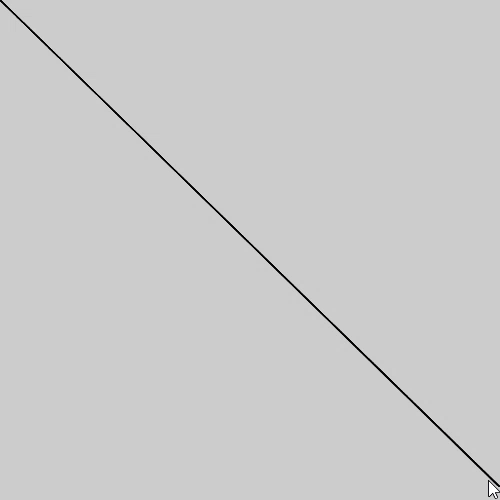
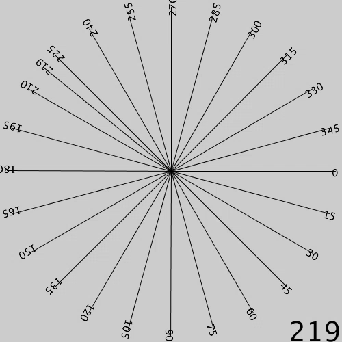

# other

## About

Other sketches without any specific purpose. If enough fit into a specific category, a new category could be created and they'll be moved. Includes stuff like jokes, tests of the processing.py library, or interesting data structures.

## Projects

- **Chaser** - A test demonstrating easing equations.

- **Clusters** - A test of a simple clusterizing algorithm.

- **DVD Logo** - A fun little sketch displaying the iconic bouncing DVD Logo. May need a little more work to better visualize true-to-heart. Centers are marked, but I don't really know how the circles radiuses are decided on. Also, the bounding boxes are terribly off. I had plans to make this much more customizable and functional, but I dropped the project since it was boring and image based. Inspired by watching a relevant The Office scene.

- **DynamicLines** - A very simple line drawing application.

- **FlipFlopChain** - A simple project displaying how one would count in binary.

- **Graph-Theory** - A simple project closely mimicking the particle.js library.

- **Old_Lines** - A short script connecting your current mouse position to that of yours moments ago.

- **Rotation_Calculator** - Displays how Processing.py calculates the final position of an object given a rotational value. Mostly a test for me, trying to understand why some of my projects would rotate in strange and confusing ways.

