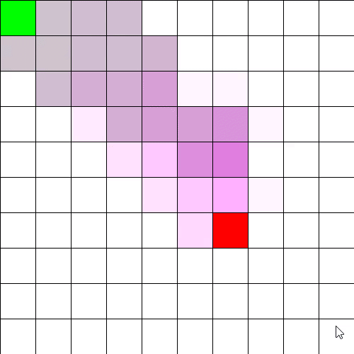

# pathfinding

## About

Projects related to pathfinding specifically. Although I studied it for a good bit, I mostly did text-based projects that broke easily outside of the Processing library. Unfortunately, the two projects I did within Processing are very buggy and were in various states of debug.

## Sketches

- **AStarPathfinding_V2** - Second pathfinding attempt with a barely working setup. Will error under certain strange circumstances. Displays a visual representation of the A* pathfinding algorithm as it paths between two points. As demonstrated in the GIF, very buggy and needs to be redone.

