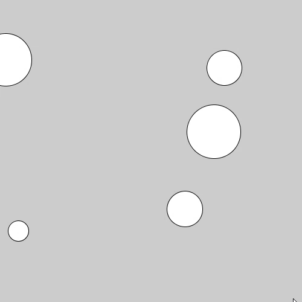
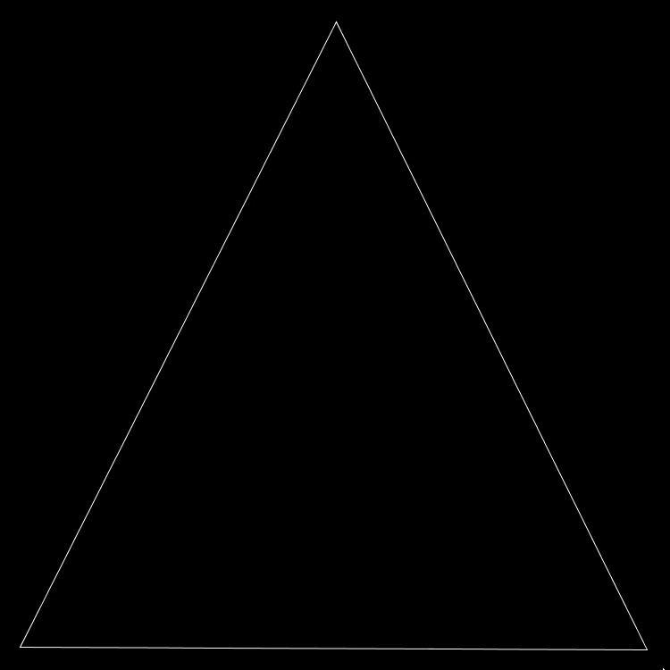
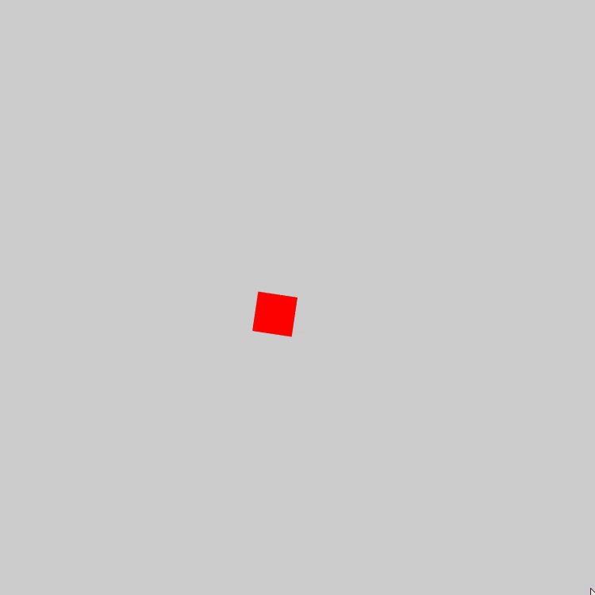
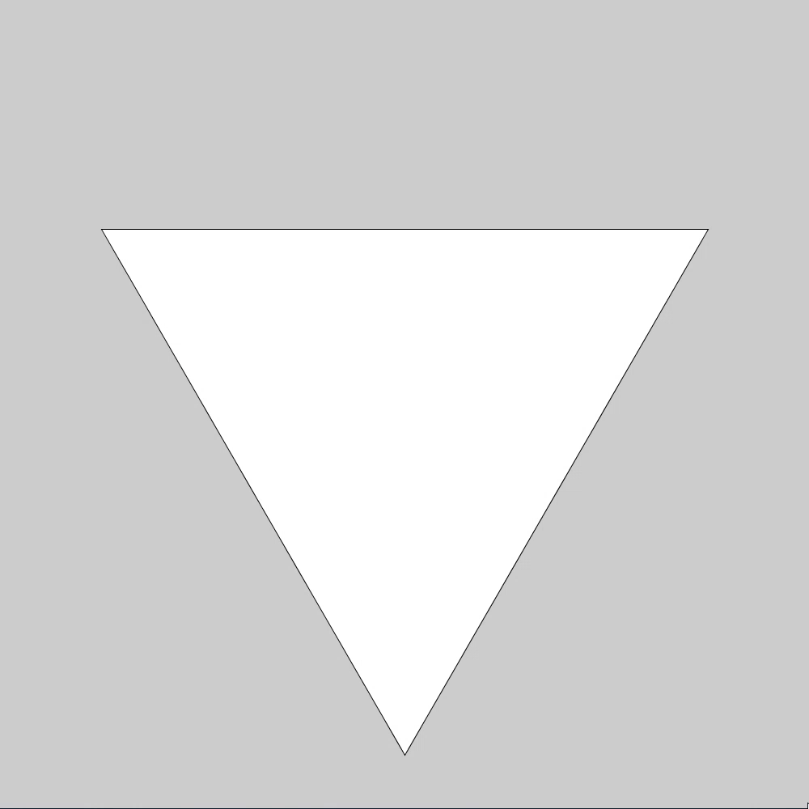

# visuals

## About

All my projects attempting to create vivid or interesting visuals using the Processing.py library. Some are algorithms, most are just for loops with tweaked constants to create interesting animation.

## Sketches

- **CircleIntersection** - Plots circles in places where others aren't, expoonentially becoming slower and slower with each successfully located spot. Somewhat buggy and needs tuning to become much faster using a better algorithm, and probably better methods for deciding where spots are (less random, more organized manner).

- **EquilateralTriangle** - Places squares in increasing size whilst rotating.

- **Gradients** - Builds simple linear RGB gradients from 1 random color to another.

- **Illusion** - A improperly named triangular rotation (I like the way they look) sketch.

- **IllusionColors** - A more proper mimic of the common illusion mechanic, but it doesn't work so well.

- **Trippy_Boxes** - Transparent rotating boxes that move throught the HSB color spectrum.

- **Rotating_HSB_Squares** - Slowly builds a mandela-like structure out of squares that slowly change color through the HSB color spectrum. Does not contain all variants, just change the `top` variables divisor from `1` to `100,000` as well as the divisor of `rot` from something in `1.0 to 10.0`, which is just below it.

- **StackingEquilateralTriangles** - Another interesting rotating triangle sketch.

- **Sierpinski_Triangle** - Builds the Sierpinski Triangle

